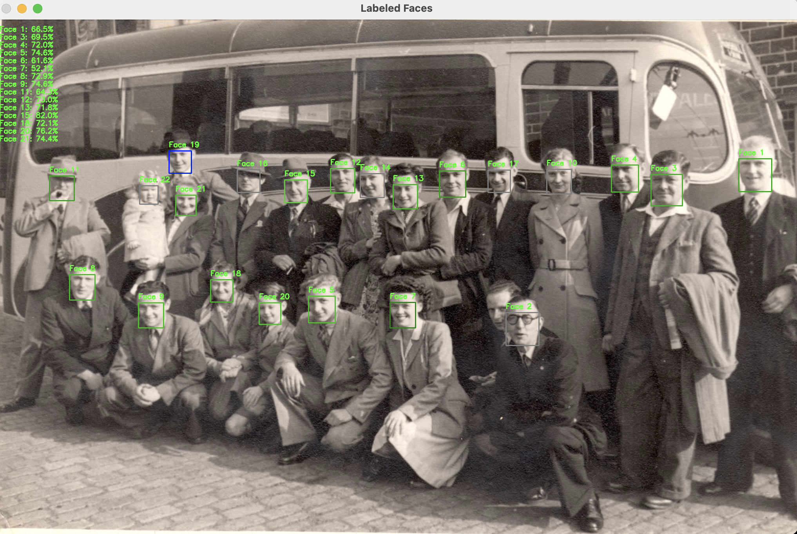

# Face Comparison Tool

A Python application that uses Face++ API to detect and compare faces in images, with an interactive visualization tool.


*Original historical photograph*


*Interactive interface showing face comparisons*

## Overview

This tool analyses photographs to:
1. Detect faces in the image
2. Generate face tokens using Face++ API
3. Compare all faces with each other to find similarities
4. Provide an interactive interface to explore face relationships

## Features

- Face detection and token generation
- Automated face comparison using Face++ API
- Interactive visualization:
  - Click on any face to see its relationships
  - Color-coded similarity indicators
  - Percentage-based similarity scores
  - Green labels for easy identification

## Requirements

- Python 3.x
- OpenCV (`opencv-python`)
- Requests
- python-dotenv
- [Face++ API account](https://www.faceplusplus.com/)

## Installation

1. Clone the repository `git clone https://github.com/jfarcher/facecompare`
2. Create a virtual environment: `python -m venv venv`
3. Activate the virtual environment: `source venv/bin/activate`
4. Install dependencies: `pip install -r requirements.txt`
5. Create a `.env` file in the root directory with your Face++ API credentials:

```
FACEPP_API_KEY=your_api_key
FACEPP_API_SECRET=your_api_secret
``` 

## Usage

1. Create a `.env` file with your Face++ API credentials:
   ```
   FACEPP_API_KEY=your_api_key
   FACEPP_API_SECRET=your_api_secret
   ```

2. Run the face comparison script:
   ```bash
   python face_compare.py path/to/your/image.jpg
   ```

3. View the interactive comparison results:
   ```bash
   python token_image.py path/to/your/image.jpg
   ```

4. The interactive viewer will:
   - Display all detected faces
   - Allow you to click on any face to see its relationships
   - Show similarity scores with color coding
   - Press ESC to exit the viewer

## Output

The tool will generate a JSON file with the face tokens and comparison results.


